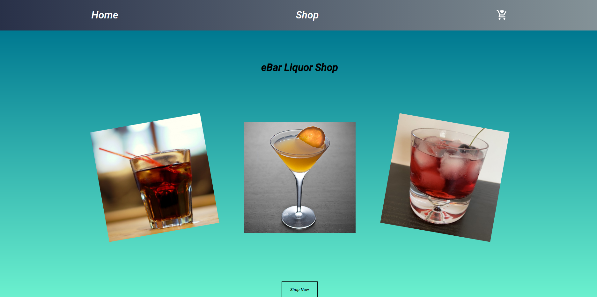

#Shopping Cart

**Link to project:**

## How It's Made:

**Tech used:** CSS, JS, React

## Lessons Learned:

I've learned about how i can utilize react routes and nested routes in order to navigate
between diffrent paths and to display different components. I've inculuded some basic react testing files,
so i can get used to testing my components.
One more thing that i get into in this project is using library for animation and transition of a div elements in React.
